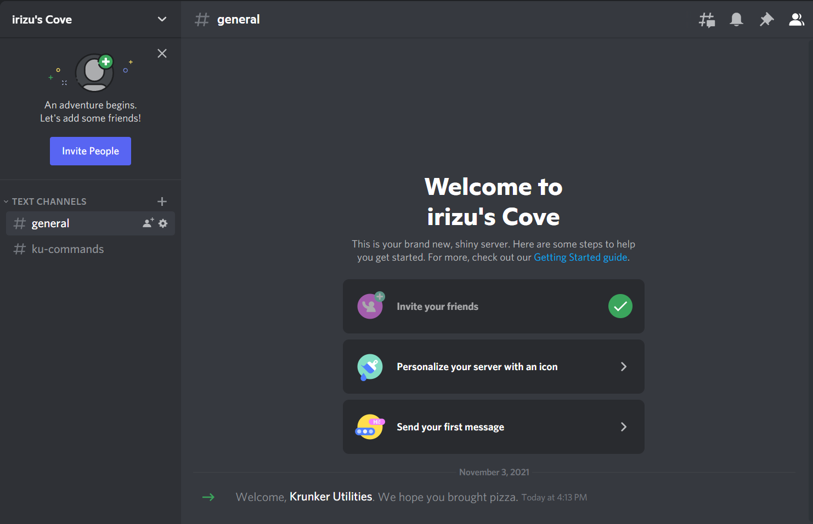
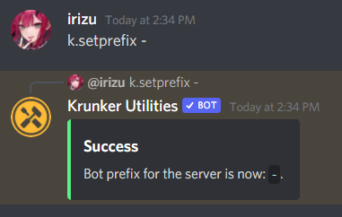
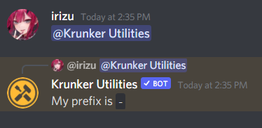
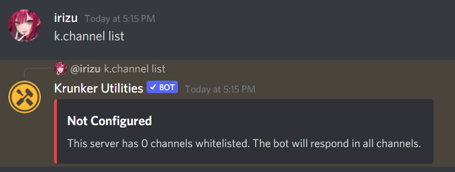
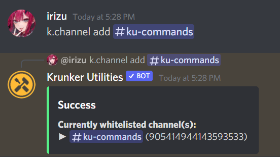
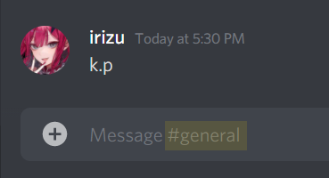
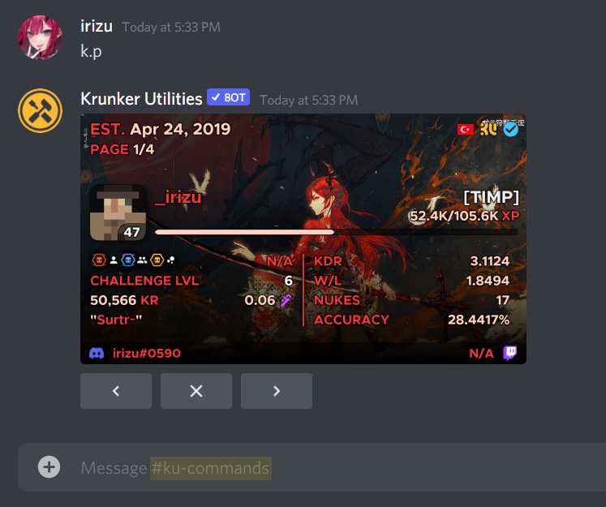
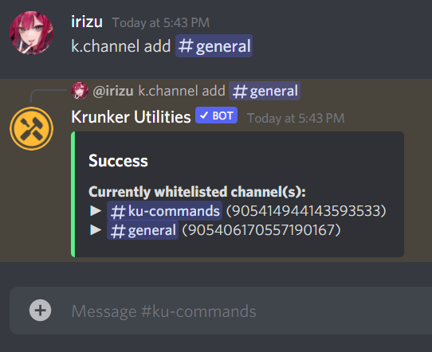
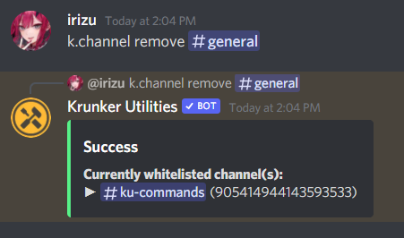

# Getting Started with KU
You have invited KU into your server, great job! Question is, what next? This is where this guide comes in to help.

By the end of this guide, you will be able to:
- [**change the bot's prefix**](gettingstarted?id=changing-the-bot-prefix)
- [**configure the channels the bot is able to work in**](gettingstarted?id=configuring-channels)

Let's get to it!

> **Note:** Here, I have created a new server to simulate the experience of a user adding the bot for the first time.
> ***
> 

***

## Changing the bot prefix

Changing the bot prefix is very simple. By default, the bot uses `k.`, but maybe that's not what you want.

Hence, we will use `setprefix` to change our prefix.

**1.** Type `k.setprefix <new prefix>`, where `<new prefix>` is the new prefix, as the name implies. Then, send the message.

In my case, I'll set it to `-`

There, not that hard, is it? 

In case you ever forget the prefix, you can always ping/mention the bot to get the current prefix.

**Now that we have covered the first part of setting up the bot, let's move on to configuring channels!**

***

## Configuring channels

Now that the bot has been set up halfway through, the second step is to set up the channels it can respond in, and the ones it isn't allowed to read.

To do this, we will be making the use of `k.channel`

**1.** Type `k.channel list`, then send the message. The bot will respond like this:

Because we don't want the bot to respond in every channel, let's add a channel so that it only responds there.

**2.** Type `k.channel add <channel mention>`, where `<channel mention>` is the channel mentioned by you. You may also use `<channel ID>` if that suits you more.

In our case, I only want the bot to respond in `#ku-commands` for now, so let's add that with `k.channel add #ku-commands`

***

As you can see below, the bot stops responding in `#general` afterwards, because we have now only allowed the bot to respond in `#ku-commands`

***

**3.** Let's add another channel using `k.channel add <channel mention>` again, because one isn't enough!

>⚠️ Make sure to use the command in the whitelisted channel now, else it won't work!

This time, I'll add `#general`

Now KU can respond in `#general` as well.

***

Now that we covered adding a channel, it is just as important to know how channels can be removed, so let's keep going.

To do this, we will now use `k.channel remove` to remove a whitelisted channel. Let's try it!
> 💡 You can check all the whitelisted channels available using `k.channel list`

**4.** Type `k.channel remove <channel mention>`, where `<channel mention>` is *a whitelisted channel.*

In my case, I'll remove `#general`

Congrats, you have now understood how to configure channels!

***

## Conclusion <!-- {docsify-ignore} -->

We have come to the end of this guide about setting up KU for use!

Feel free to explore the docs for commands you wish to learn about, or you can read the next guide [here](linking_guide?id=a-brief-look-at-linking) to link your account!