# Customisation in KU
Before update 3.0 and 4.0, customisation in KU was not appealing to use, due to the obstructive design.

However, KU has come a long way since then, and customisation is now **the bread & butter of KU.**

With the new dashboard and all possible opportunities for customisation, making your personalised profile in KU has never been easier than now!

## How does KU's customisation stand out in comparison to other Krunker bots? <!-- {docsify-ignore} -->
- Customisation in KU is **completely free.** We don't have any paywall behind our customisation features, they are free to access for everyone. All it requires is your Krunker account to be linked.
- **It is very easy to customise your profile with KU**, thanks to the dashboard being intuitive. *No more cramming up commands to customise your profile, leave all the work to the bot!*
- Our new and improved layouts are focused on making a custom profile **stand out as much as possible.**

Now that we have explained why KU's customisation ability is better, let's move on to how to customise your profile!

***

## Rules for Customisation
- Your background and bio must follow [Discord's Terms of Service](https://discord.com/terms) & [Community Guidelines](https://discord.com/guidelines), as well as [Krunker's Terms of Service.](https://krunker.io/docs/terms.txt)
- The backgrounds must not be
	- completely transparent
	- containing fake stats or badges
	- epileptic and flashy

***

## Prerequisites
Before we proceed, there are the some things to keep in mind,
- Please make sure <u>you have a Krunker account linked to your Discord.</u> If you don't have one linked, make sure to check [here](linking_guide) to learn how~
- Make sure your background is uploaded on [Imgur](https://imgur.com), and have the source link ready. 

The source link looks like this:
`https://i.imgur.com/<7-digit-code>.<file-extension>`

Example:
> https://i.imgur.com/ATwAW7D.png

- The preferred resolution of an image for background is `1280x720`. However, **the minimal requirement** is for the image to **have an aspect ratio of `16:9`**, and not to go beyond **1080p i.e HD resolution**. Different aspect ratios will cause the background to have stretches.
- The background and/or bio must follow the [rules!](ku_customisation?id=rules-for-customisation)

Now that we have the things we need, let's move on to understanding the core part of customisation: **the dashboard.**

***

## Understanding the Dashboard

Update v4.0 introduces you to a new addition to KU: the dashboard! 

The dashboard makes customisation a lot more intuitive and easy, hence understanding it is a core thing to do!

Now that we have established the importance of the dashboard, let's check it out!

1. When opening the first time, the dashboard will ask you to log in via Discord. Please do so to proceed.

> ⚠️ Make sure the Discord account you use has a Krunker account linked to it

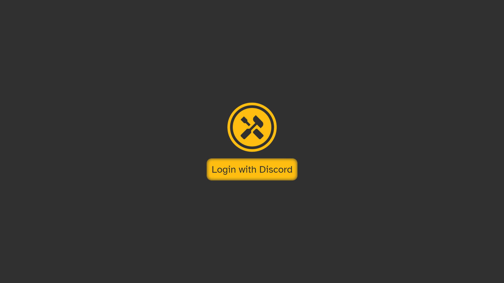

2. Once you have logged in, this is how it would look:

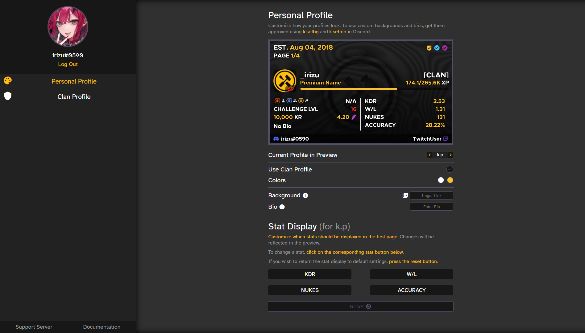

I bet this looks confusing, so let us simplify stuff up~

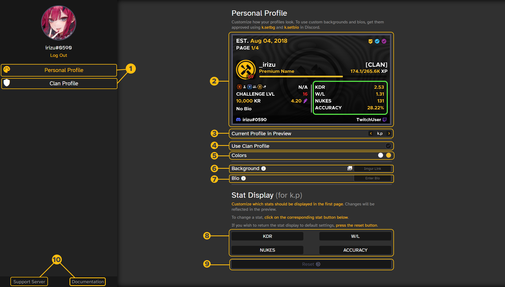

> 1. **Profiles:**
> - **Personal Profile:** This is where you will be managing **your** own profile's background, bio, color palette and more.
> - **Clan Profile:** This section is where a clan leader or captain can adjust how their clan member's profile looks. **Only the clan leader (Commander) and Captains have access to this part.** This section is the same as **Personal Profile**, but with the exception of *Stat Display.*
> ***
> 2.  **Preview Window:** This is where you can observe any changes you make to your profile. Changes take place in real-time and there is rarely any delay. **Preview can render from both approved *and* unapproved backgrounds and bios.**
> ***
> 3. **Current Profile in Preview:** This allows you to select which profile should the preview show.
> ***
> 4. **Use Clan Profile:** This option allows you to choose whether you want to use the clan;s profile preset or not. It is disabled by default. When enabled, all personal customisation options get closed and the clan preset is used.
> ***
> 5. **Colors:** This allows you to select the main color and the accent color for your profile.
> ***
> 6. **Background:** Here, you can enter the background you wish to preview and/or save. You can view and select your approved backgrounds by clicking the gallery icon next to it.
> ***
> 7. **Bio:** Here, you can enter the bio you wish to preview.
> ***
> 8. **Stat buttons for Stat Display:** These allow you to customise which 4 stats should be on display in the right column for the first page *(see green box).*
> ***
> 9. **Reset button for Stat Display:** This allows you to reset the stats on the right column back to default settings.
> ***
> 10. **Links to the Bunkerbots Support Server & KU Documentation:** For quick support and guidance~

This concludes the explanation of the dashboard. Now, let's move on to actually start customising our profile!

***

## Submitting a background
Before we are able to start customising our profile, we need to submit our background image for usage approval. This is important, as *unapproved backgrounds can't be used with the bot.* Luckily, this is an easy process, so let's get over with it!

Let's start with the background first, using `k.setbg`

1. Go to a channel where KU can respond, and send `k.setbg <imgur-link>`, where `<imgur-link>` refers to the Imgur source link to the background you wish to have, as stated in [Prerequisites](ku_customisation?id=prerequisites). 

The bot will respond with a confirmation message containing the submission rules. React with the tick to proceed.

> ⚠️ The confirmation message only stays up for 10 seconds, make sure to react in time, else the request gets cancelled! 

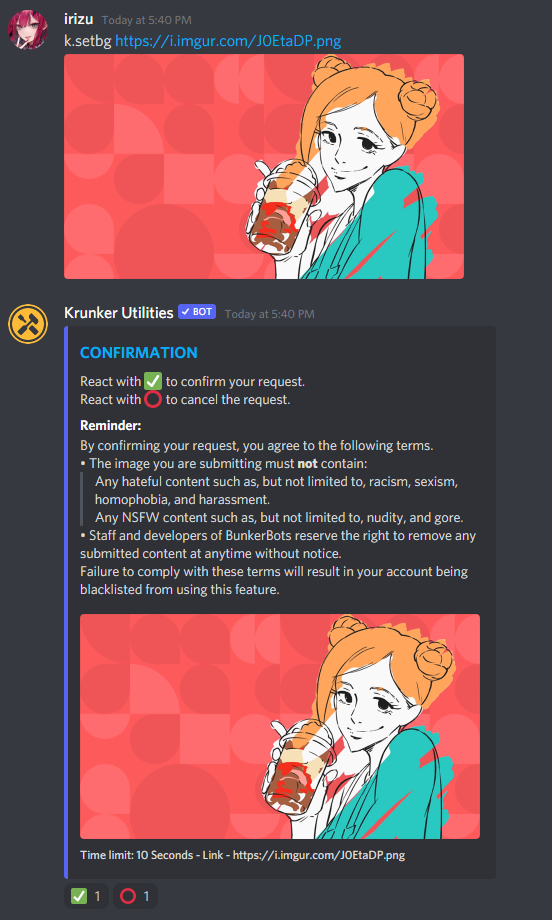

2. On reaction, you should be seeing this message.

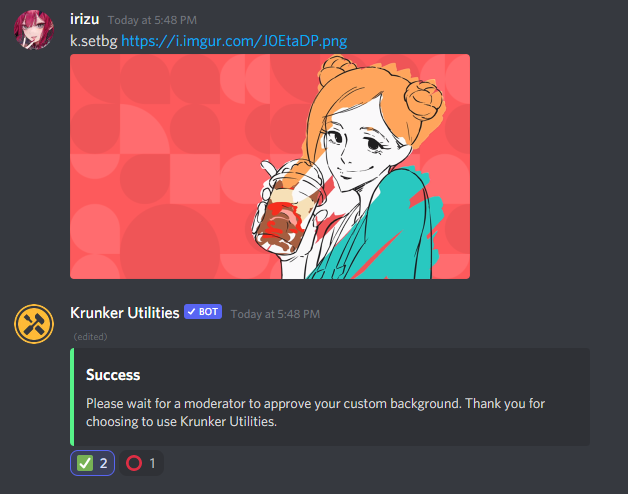

 Now please wait till your background request gets approved. You will get a DM once it's approved, and the default background (or last custom background) gets replaced with the new background.
 > - ❔ Approvals usually take 5-15 minutes, but due to timezone differences, it can take upto 12h. So please be patient!
 > - ⚠️ Keep your DMs open, else you won't be able to know when it gets approved.
 > -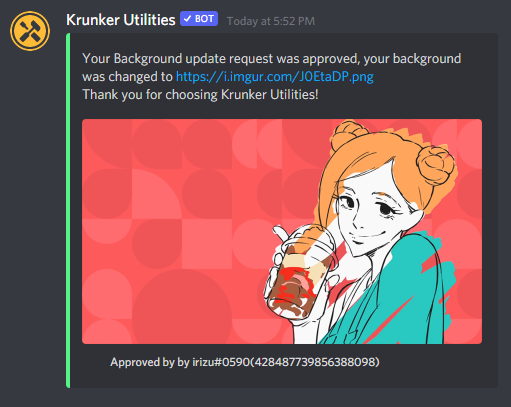
 > - Previously approved backgrounds can be used without waiting for approval, as shown below
 > - 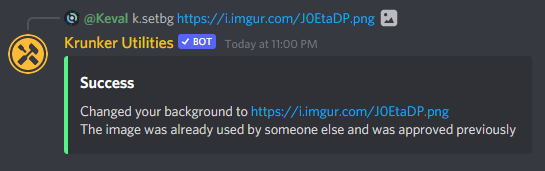
 > - ❗ There is no limit to the number of backgrounds one can have, just use `k.setbg` to add another background!
 
 ***
 
 ### Conclusion
 With this, we conclude the submission of background! Let's move on to using it in the dashboard.
 
 ***
 
 ## Customising via the Dashboard
 
 >- ⚠️ Make sure you have a Krunker account linked with your Discord.
 >- ⚠️ We will proceed with the assumption that you have multiple backgrounds approved.

 1. Head over to the [dashboard](https://dashboard.bunkerbots.tech/) and log in via Discord.
 2. The dashboard should be open now. By default, the most recently approved background is set in use. The same applies for bios.

We will now separate this part into 3 sub-parts:
- [Selecting a different background](ku_customisation?id=selecting-a-different-background)
- [Changing the text colors](ku_customisation?id=changing-the-text-colors)
- [Changing the bio](ku_customisation?id=changing-the-bio)
- [Changing which stats are on display on the first page for `k.p` | Stat Display ](ku_customisation?id=changing-which-stats-are-on-display-on-the-first-page-for-kp)

>- ⚠️ All parts except Stat Display work the same way for Clan Profile as they do for Personal Profile.
>- ⚠️ Stat Display is only available for Personal Profile.

***

### Selecting a different background

1. Click the gallery icon next to Background
2. A pop-up menu will open up. This menu contains all the approved backgrounds you submitted. 
	- Select the background you wish to use.
	- A preview with the new background will be generated in the preview window. 

3. If satisfied, click `Save` to save changes.

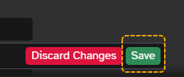

Enjoy the new background!
 
***

### Changing the text colors

1. Click the one of the two colors next to `Colors`

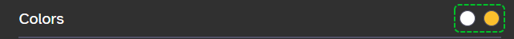

2. A color picker will open up. Adjust the colors here with ease.
> ❗ Changes to colors can be seen in the preview window in real-time.

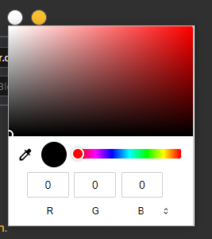

3. Once done, click `Save` to save changes.

Enjoy your new colors!

***

### Changing the bio

> ⚠️ Changing bios via dashboard is currently not supported.

For the same reasons as backgrounds, bios need to be approved before they can be used.

To do this, we will be using `k.setbio`
 
 - Go to a channel where KU can respond, and send `k.setbio <bio>`, where `<bio>` is the custom bio you entered.
 - KU responds with a confirmation message, please react to the tick here.
 
 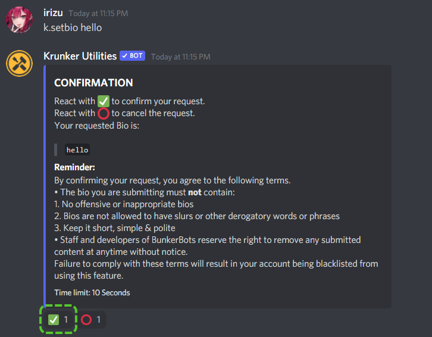
 
 - Once reacted, you will get a message that your bio has been sent for approval. Again, please wait as you did for the background, until you get a DM.
 
 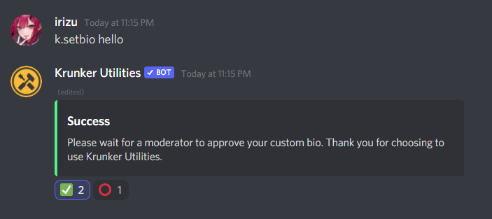
 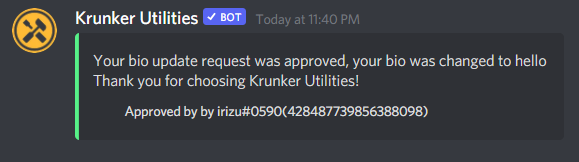

 >- ⚠️ Bio can't be longer than `18` letters.
 >-  ❗ There is no limit to the amount of bios one can have, just use `k.setbio` to add a new one!

***

### Changing which stats are on display on the first page for `k.p`

>⚠️ Exclusive to Personal Profile only.

**Stat Display** allows you to choose which stats should be on display on the right column, for the first page of `k.p`

1. Press one of the stat buttons. A menu containing all stats will appear.
2. Select the stat you want. This will replace the old one.
3. Check the preview window for changes.

4. - If satisfied, click `Save` to save changes.

> - ⚠️ If you wish to revert back to the default settings, you can click the reset button at the bottom then save changes.
> - 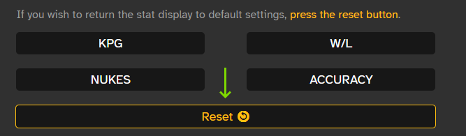

***

### Conclusion

With this, we conclude the guide to Customisation in KU. We know it's a long read, but this is actually simple in practice. Of course, we will try to make things simpler in the future, so count on us!

Not that it's necessary, but we recommend you to read *this guide*  to optimize the customisation workflow for yourself!

Now that you are done with all the guides, feel free to use the bot, and have fun~

***

## A tip for customisation

You have probably noticed this by now, but in case you haven't, **the preview window can render the profile regardless of the background and/or bio being approved or not.** 

gifimg

Sweet, right? So what's the purpose, you ask?

Well, **you can use this trick to test backgrounds and bios to see how they look before you upload on Imgur and get them approved.**
> ⚠️ The link still must be an imgur direct link to the background.
> ⚠️ While you can preview unapproved backgrounds and bios, approval is <u>still required</u> to save changes.