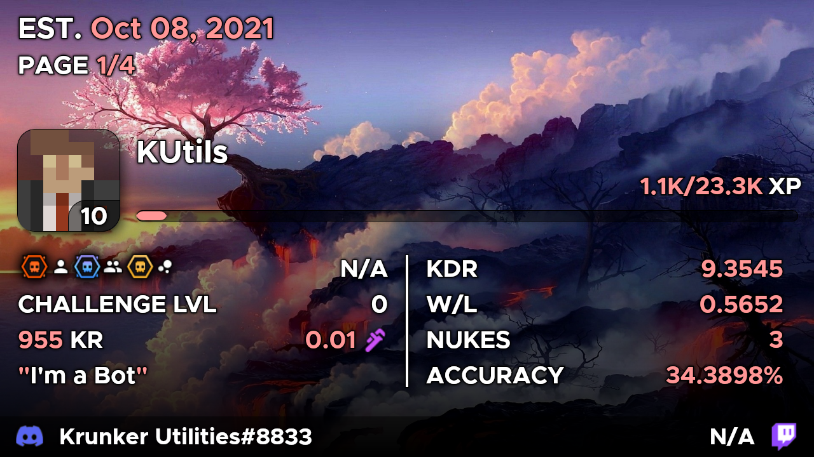
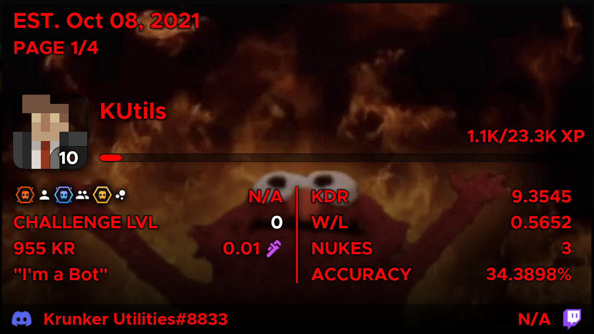
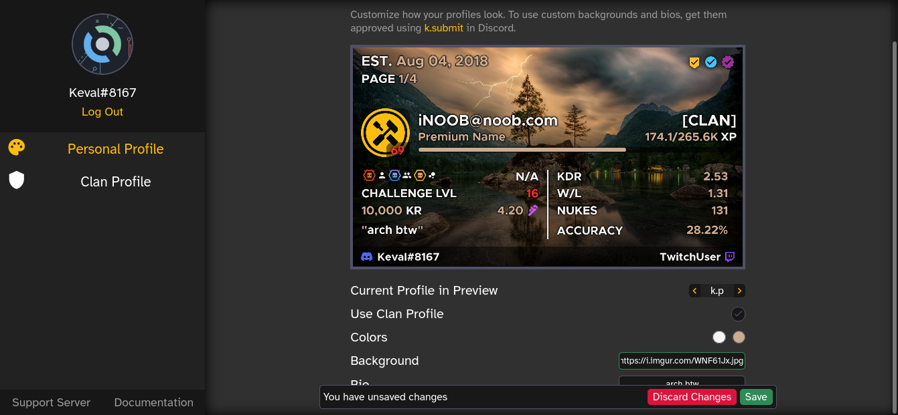

# Features

### A fresh new design
The new design is more spacious, casual and inviting than the previous design, while also being legible, readable and easy on the eyes!

 

### Extensive Customisation, at no cost
Personalize your profile and express your desire. Let your imagination run wild.

Because KU's extensive set of features to handle customisation is here to take care of your needs. *All your needs.*

The best part? It's all **free**. No need to pay for anything, it's yours to use. Go ham.

 

### Enter the next big thing: the dashboard
No need for extensive memorisation of commands, just do it all on the dashboard!

Name it all, the dashboard can do it all, in real-time. 

With an intuitive interface and controls, even a drunk guy can use this without fail.

 

So what are you waiting for? Get a piece of the action yourself already!
